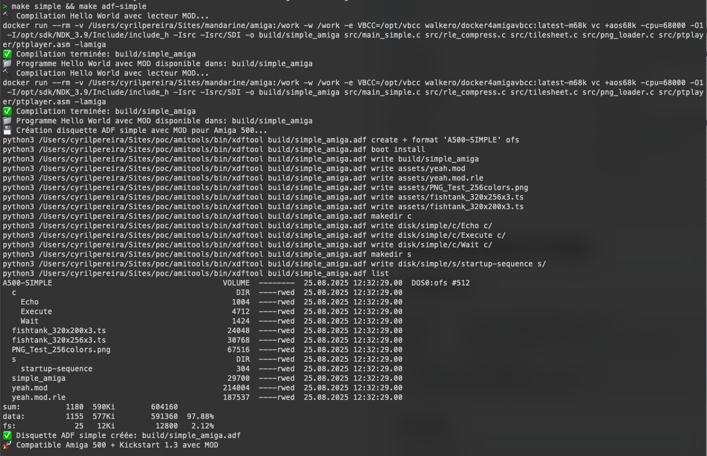

# Projet Mandarine Amiga

## Architecture

```
assets       # all the assets images and mods
build        # adf build and exe
disk         # disk tool c and s to make the disk bootable
src
├── SDI      # the SDI lib
├── ptplayer # the ptplayer lib to play mod
└── main_simple.c # main source code
```

## Compile

I am using docker to build and run the compilation

Use the makefile to do it

Here is the code if you want to learn more 

```
docker run --rm -v ${pwd}:/work -w /work -e VBCC=/opt/vbcc walkero/docker4amigavbcc:latest-m68k vc +aos68k -cpu=68000 -O1 -I/opt/sdk/NDK_3.9/Include/include_h -Isrc -Isrc/SDI -o build/simple_amiga src/main_simple.c src/rle_compress.c src/tilesheet.c src/png_loader.c src/ptplayer/ptplayer.asm -lamiga
```

### Compile the exe

```
make simple
```

### Compile the ADF with assets and exe

```
make simple
makd adf-simple
```




## Convert PNG to RAW

```
python3 convert_font_png.py input.png 
```